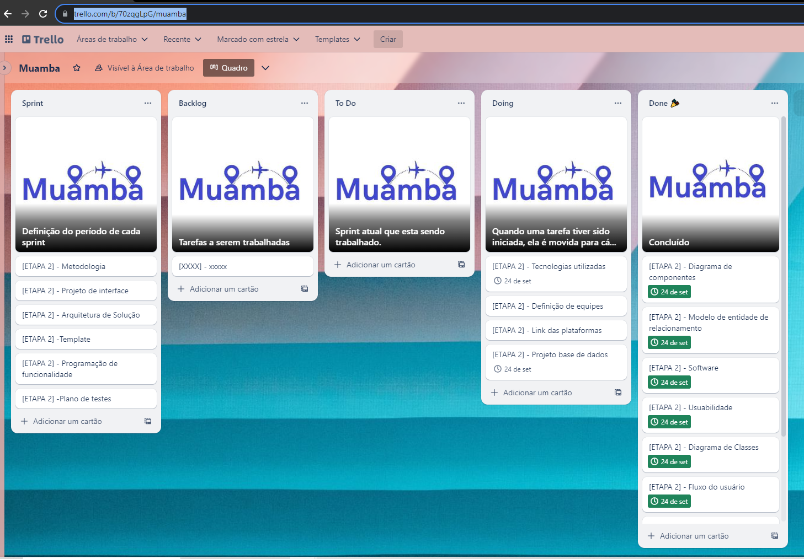

# Metodologia

As definições ferramentais utilizadas nesse projeto, tanto para manutenção dos códigos quanto para organização e execução das tarefas estão apontadas na tabela abaixo:

## Relação de Ambiente de Trabalho
| Ambiente| Plataforma | Link de Acesso |
|---------|------------|----------------|
| Repositório de código fonte | GitHub |[Github](https://github.com/ICEI-PUC-Minas-PMV-ADS/pmv-ads-2023-2-e2-proj-int-t4-Muamba)|
| Documento do Projeto | GitHub| [Github](https://github.com/ICEI-PUC-Minas-PMV-ADS/pmv-ads-2023-2-e2-proj-int-t4-Muamba)|
| Projeto de Interface e Wireframes | MarvelApp | [Marvel](https://marvelapp.com/project/6697348)|
| Gerenciamento do Projeto | Trello | [Trello](https://trello.com/b/70zqgLpG/muamba)

## Gerenciamento do Projeto
A equipe utiliza metodologias ágeis, tendo escolhido o Scrum como base para definição do processo de desenvolvimento.
A equipe está organizada da seguinte maneira:

|Funções|Colaborador|
|---------|------------|
| Scrum Master:|Liana Nagasawa|
| Product Owner:|Pedro Vitor|
| Equipe de Desenvolvimento:|Larissa Mara|
| |Pedro Vitor|
| |Liana Nagasawa|
| |Douglas Ferreira|
| Equipe de Designer:|Douglas Ferreira|

Para organização e distribuição das tarefas desse projeto, a equipe está utilizando o Trello, estruturado com Recursos: Backlog, ToDo, Doing, Test, Done e Locked. Com etiquetas: Documentação, Desenvolvimento, Infraestrutura, testes, Gerencia de Projetos. 
O quadro do Trello está disponível através da URL: [Trello](https://trello.com/b/70zqgLpG/muamba)

Tela Trello utilizada pelo grupo

### Processo

Coloque  informações sobre detalhes da implementação do Scrum seguido pelo grupo. O grupo poderá fazer uso de ferramentas on-line para acompanhar o andamento do projeto, a execução das tarefas e o status de desenvolvimento da solução.
 
> **Links Úteis**:
> - [Project management, made simple](https://github.com/features/project-management/)
> - [Sobre quadros de projeto](https://docs.github.com/pt/github/managing-your-work-on-github/about-project-boards)
> - [Como criar Backlogs no Github](https://www.youtube.com/watch?v=RXEy6CFu9Hk)
> - [Tutorial Slack](https://slack.com/intl/en-br/)

### Ferramentas

As ferramentas empregadas no projeto são:

- Editor de código.
- Ferramentas de comunicação
- Ferramentas de desenho de tela (_wireframing_)

O editor de código foi escolhido porque ele possui uma integração com o
sistema de versão. As ferramentas de comunicação utilizadas possuem
integração semelhante e por isso foram selecionadas. Por fim, para criar
diagramas utilizamos essa ferramenta por melhor captar as
necessidades da nossa solução.

Liste quais ferramentas foram empregadas no desenvolvimento do projeto, justificando a escolha delas, sempre que possível.
 
> **Possíveis Ferramentas que auxiliarão no gerenciamento**: 
> - [Slack](https://slack.com/)
> - [Github](https://github.com/)
