# Projeto de Interface

Nesse projeto, se estabelece o foco em questões como agilidade, acessibilidade e usabilidade.

## Diagrama de Fluxo

Este diagrama apresenta o estudo do fluxo de interação do usuário com o sistema interativo. 

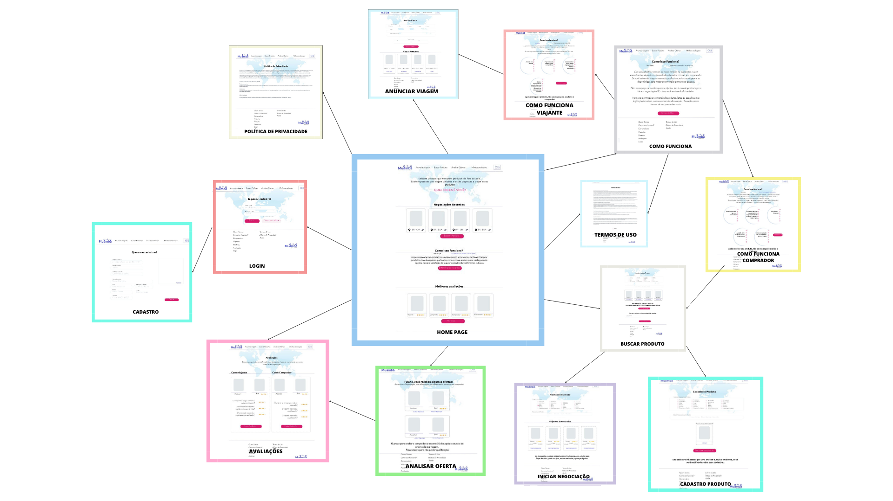

## Wireframes

Conforme fluxo de telas do projeto, apresentado no item anterior, as telas do sistema são apresentadas em detalhes nos itens que se seguem. 

### Index
O Projeto terá na tela Index, informações sobre os membros do grupo, sobre a Instituição e coordenador do projeto. 

### Home-Page
A tela Home-Page mostra destaques dos conteúdos oferecidos, como “Negociações Recentes”, “Como isso Funciona” tanto para usuários Compradores quanto para usuários viajantes e “Melhores Avaliados”.  É composto, também, por cabeçalho e rodapé que seguem padrão para todas as páginas. 

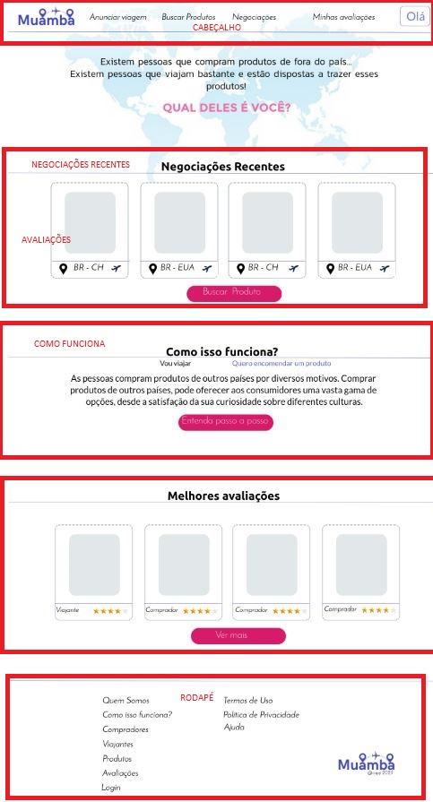

### Como isso funciona?
A tela “Como Isso Funciona” tem uma breve descrição do funcionamento do site e um link para a página “Termos de Uso”, os links para as páginas ”Como isso Funciona para Comprador” e “ Como isso Funciona para Viajante”.

### Como isso funciona para comprador?
A tela Como Isso Funciona para comprador, tem uma breve descrição do funcionamento do site para os compradores, o passo-a-passo para iniciar a busca de produtos e o link para iniciar a página “buscar de produtos”.

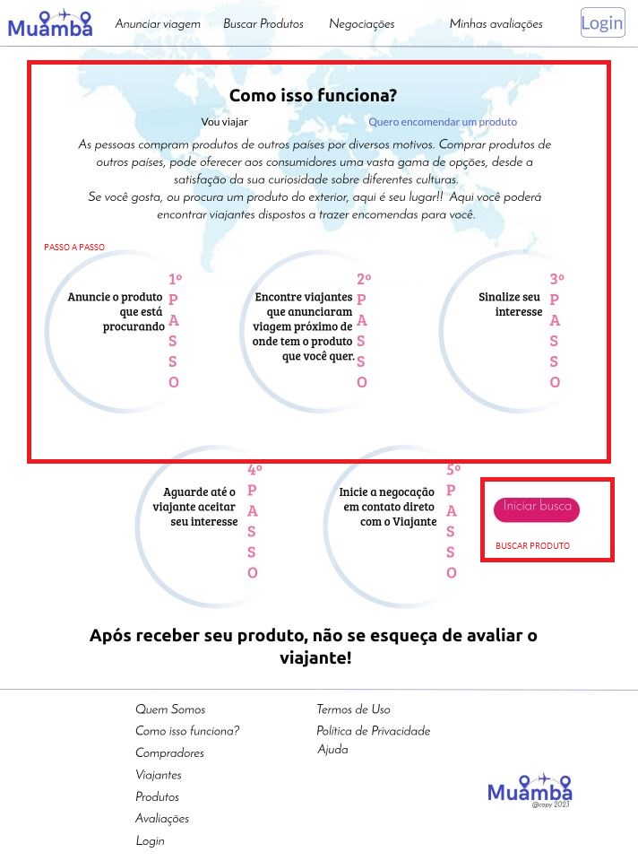

### Como isso funciona para Viajante?
A tela Como Isso Funciona para Viajante, tem uma breve descrição do funcionamento do site para os Viajantes, o passo-a-passo utilização do site como Viajante e o link para página “Anunciar Viagem”.

### Login
A tela “Login”, solicita e-mail e senha para o usuário efetuar o login e ainda o link para página “Cadastro”.

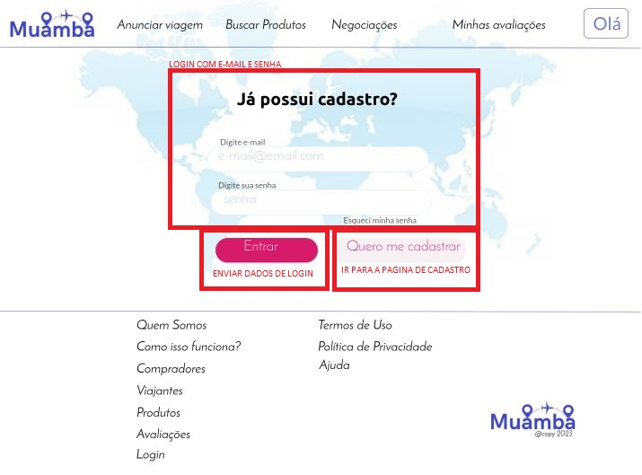

### Cadastro
A tela “Cadastro”, possui campos para o envio de informações necessárias para cadastro, como e-mail, senha, confirmação de senha, Nome Completo, CPF, Estado, Cidade, Data de Nascimento, Telefone e um campo de inserir imagem. 

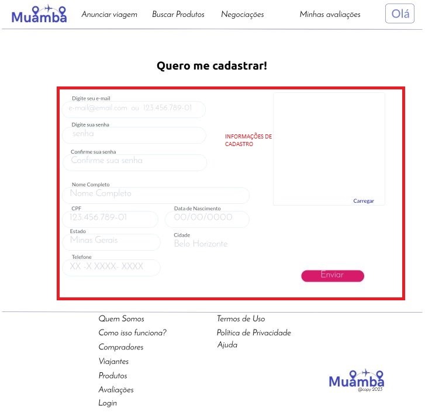

### Buscar Produtos
A tela “Buscar Produtos” oferece seleção de categoria e a inserção de até 10 palavras-chave para buscar o produto e como opcional o usuário pode filtrar a busca de viajante por localidade e ir para a página “buscar viajante”.  Caso o produto não seja encontrado, poderá ser cadastrado utilizando o link para a página “Cadastro de Produtos”.

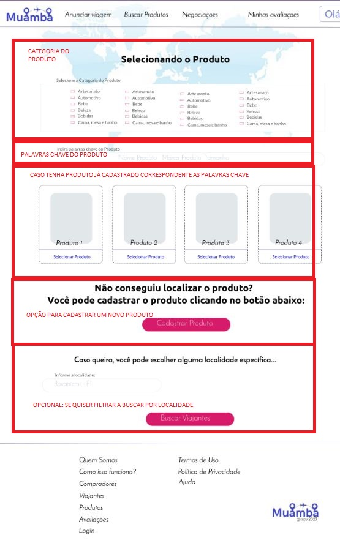

### Cadastro Produto
A tela “Cadastro de Produto” oferece seleção de categoria, a inserção de até 10 palavras-chave e uma imagem para cadastrar o produto. Após o envio das informações, o dono do site deverá analisar se o produto está dentro das Regras de Negócio.

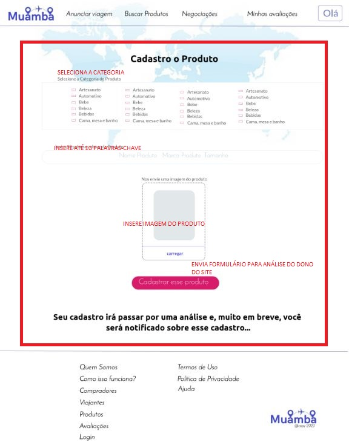

### Anunciar Viagem
A tela “Anunciar Viagem”, oferece a seleção das informações do local da viagem, e período da viagem. Mostra, ainda, as viagens já anunciadas por esse usuário e o status delas (se já avaliadas/ finalizadas, se se ainda precisa avaliar e a opção de cancelar o anúncio da viagem). 

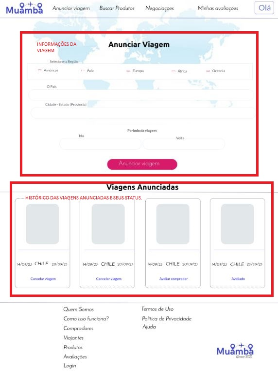

### Iniciar Negociação
A tela “Iniciar Negociação” mostra os viajantes encontrados e o link para iniciar negociação. Mostra, também, uma mensagem caso não tenha sido encontrado nenhum viajante. 

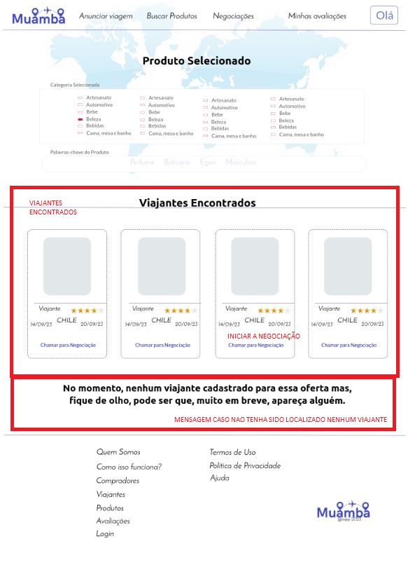

### Negociações
A tela “Negociações” mostra todas as ofertas de negociações recebidas para viajantes e a opção de aceitar ou não. Mostra, também, todas as negociações iniciadas pelo comprador e se foi aceita, recusada ou está pendente.

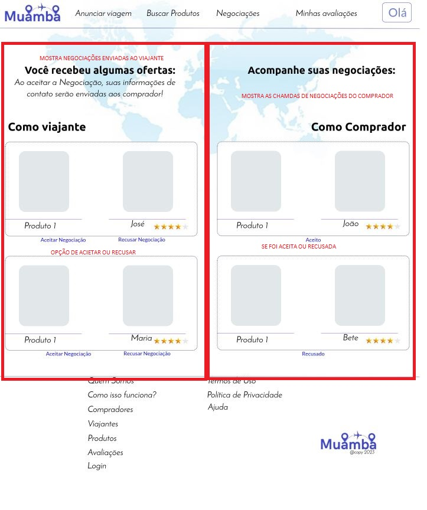

### Avaliações
A tela “Avaliações” mostra todas as negociações avaliadas ou pendentes de avaliações. 

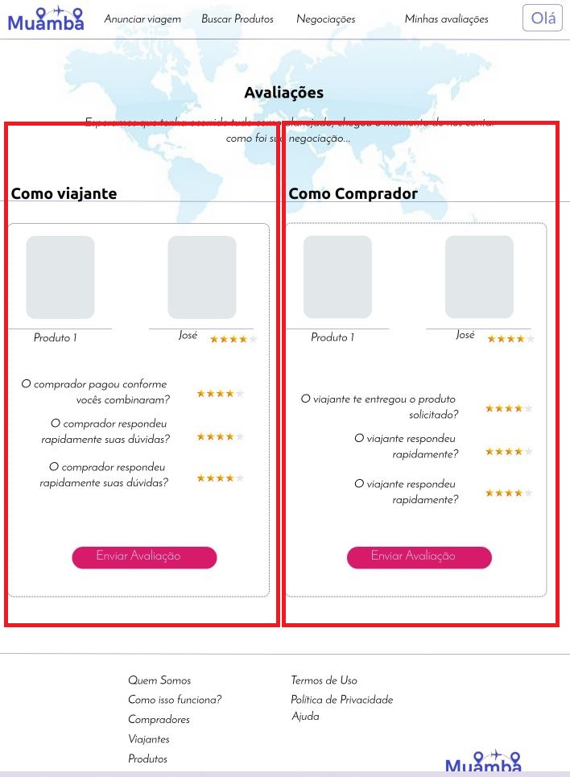

### Termos de Uso
A tela “Termos de Uso” mostra todos os Termos de Uso necessários para utilização do site, o usuário deverá aceitá-lo para se cadastrar e utilizar o site. 

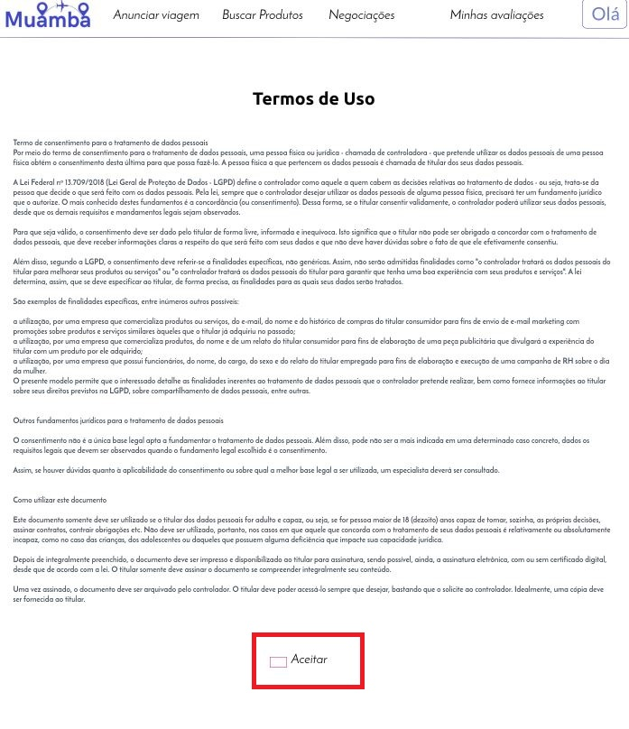

### Política de Privacidade
A tela “Política de Privacidade” deixa claro a política de privacidade adotada pelo site. 

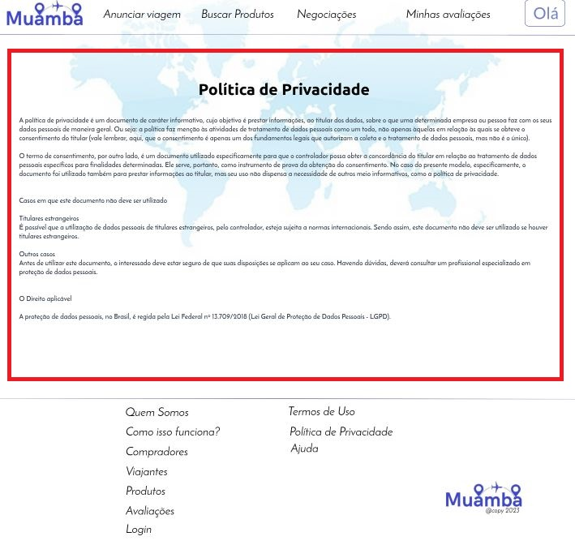
