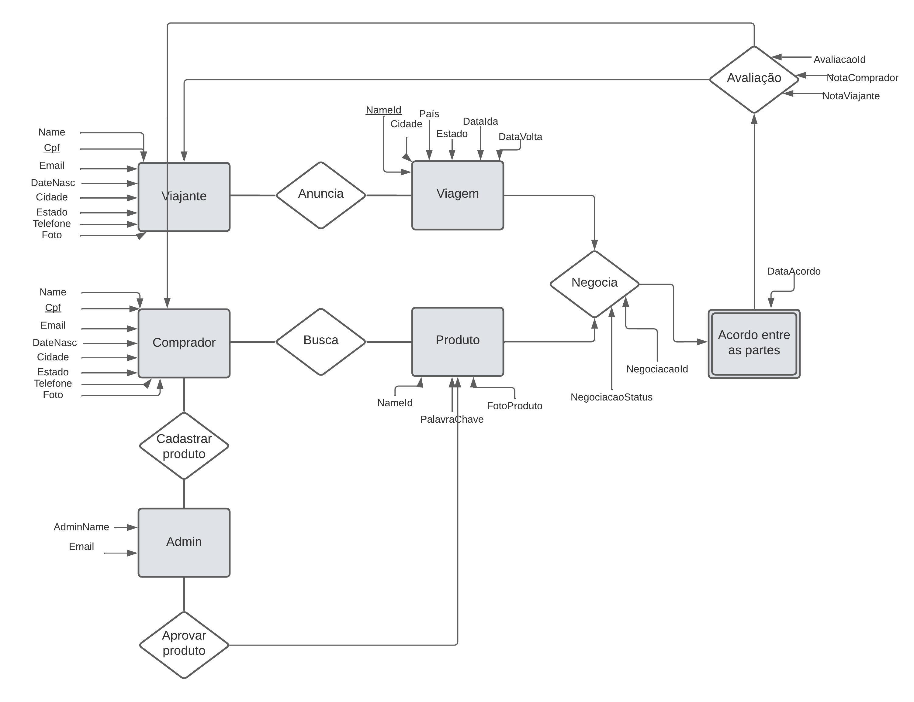
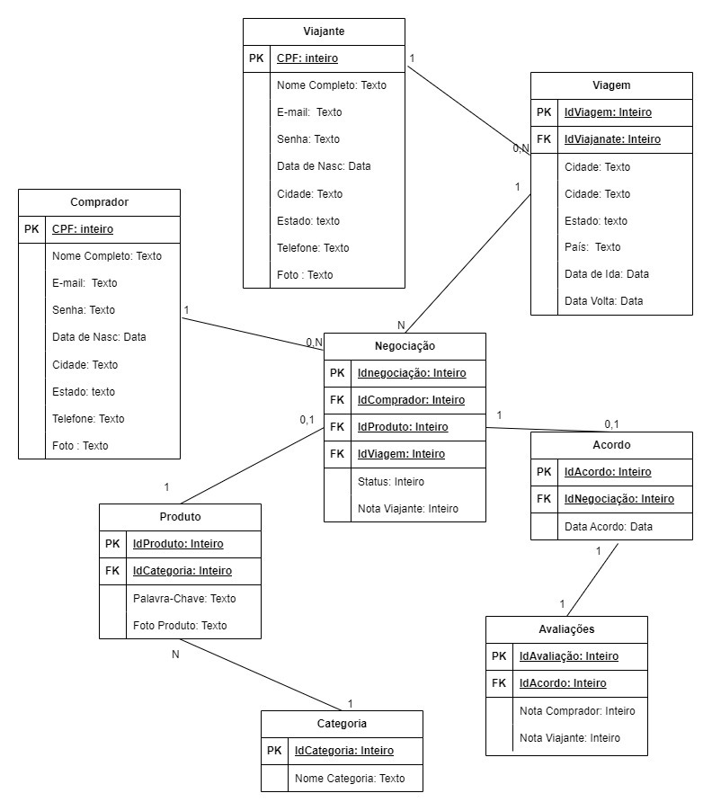
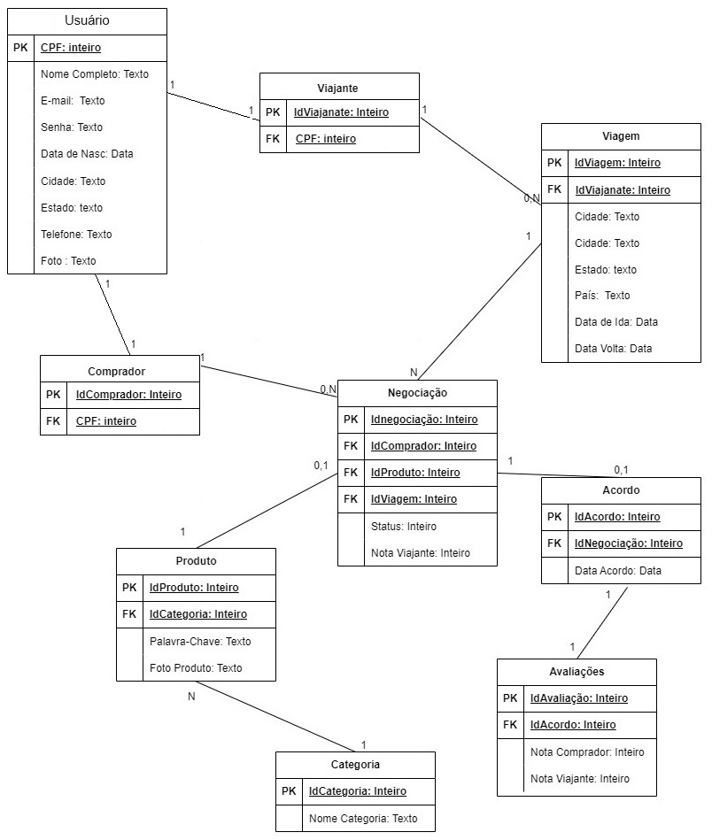

# Arquitetura da Solução

Abaixo a definição de como o software é estruturado em termos dos componentes que fazem parte da solução e do ambiente de hospedagem da aplicação.

## Diagrama de Classes

Este diagrama apresenta o estudo do fluxo de interação do usuário com o sistema interativo. 

 *Figura 20 - Diagrama de Classes Muamba*

## Modelo ER (Projeto Conceitual)

O Modelo ER representa através de um diagrama como as entidades (coisas, objetos) se relacionam entre si na aplicação interativa.

 *Figura 21 - Projeto Conceitual Entidades de Relacionamento*

## Projeto da Base de Dados

Esse é o projeto da base de dados que corresponde à representação das entidades e relacionamento. 
 Ainda em dúvida nesse tema, o grupo apresenta duas possibilidades nas imagens que seguem:

 *Figura 23 - Projeto Banco de Dados*

 *Figura 23 - Projeto Banco de Dados*

## Tecnologias Utilizadas

- Lucidchart app
- Marvel app
- Trello
- GitHub
- Draw.io
  
Apresente também uma figura explicando como as tecnologias estão relacionadas ou como uma interação do usuário com o sistema vai ser conduzida, por onde ela passa até retornar uma resposta ao usuário.

## Hospedagem

Explique como a hospedagem e o lançamento da plataforma foi feita.

> **Links Úteis**:
>
> - [Website com GitHub Pages](https://pages.github.com/)
> - [Programação colaborativa com Repl.it](https://repl.it/)
> - [Getting Started with Heroku](https://devcenter.heroku.com/start)
> - [Publicando Seu Site No Heroku](http://pythonclub.com.br/publicando-seu-hello-world-no-heroku.html)
