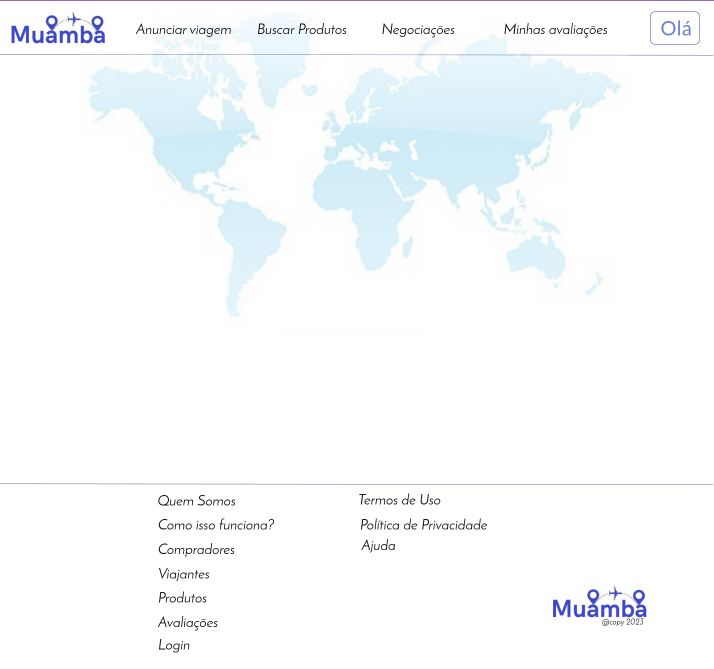
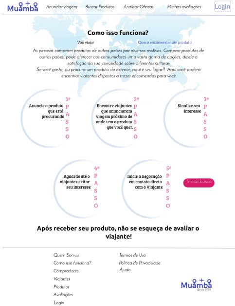
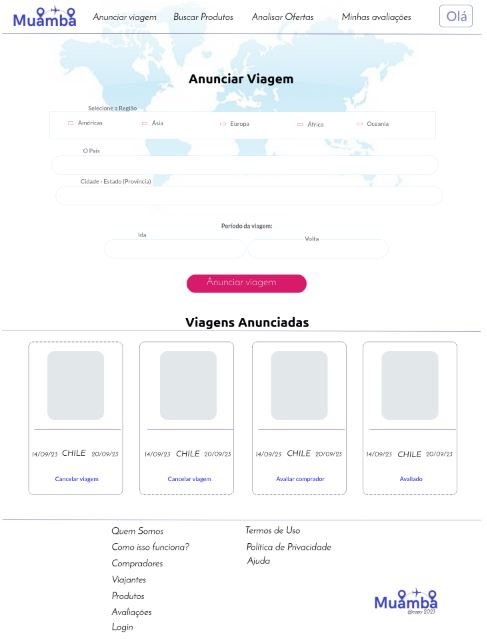

# Template Padrão da Aplicação

Abaixo está apresentado o layout padrão do site (HTML e CSS) que será utilizado em todas as páginas com a definição de identidade visual, aspectos de responsividade e iconografia:

 *Figura 24 - Template Site Muamba*

O template criado está disponível no site www.muamba.com.br e é composto pelos seguintes layouts:
1.	Index
2.	Home-Page
3.	Como Funciona
4.	Como Funciona para Viajantes
5.	Como Funciona para Compradores
6.	Login
7.	Cadastro
8.	Buscar Produtos
9.	Cadastro de Produtos
10.	Anunciar Viagem
11.	Iniciar Negociações
12.	Negociações
13.	Avaliações
14.	Termos de uso
15.	Política de Privacidade

## Index

 *Figura 25 - Página Index Muamba*
  
## Home-Page

 *Figura 26 - Página Home Page parte superior Muamba* 

 *Figura 27 - Página Home Page parte inferior Muamba* 
  
## Como Funciona

 *Figura 28 - Página Como Funciona Muamba* 
  
## Como Funciona Viajantes

 *Figura 29 - Página Como Funciona para Viajantes Muamba* 
  
## Como Funciona Compradores

 *Figura 30 - Página Como Funciona para Compradores Muamba* 
  
## Como Funciona Compradores

 *Figura 31 - Página Como Funciona para Compradores Muamba* 
  
## Login

 *Figura 32 - Página Login Muamba* 
  
## Cadastro

 *Figura 33 - Página Cadastro de Ususário Muamba* 
  
## Buscar Produtos

 *Figura 34 - Página Buscar Produto Muamba* 
  
## Cadastrar Produto

 *Figura 35 - Página Cadastrar Produto Muamba* 
  
## Anunciar Viagem

 *Figura 36 - Página Anunciar Viagem Muamba* 
  
## Iniciar Negociação

 *Figura 37 - Página Iniciar Negociação Muamba* 
  
## Negociações

 *Figura 38 - Página Negociações Muamba* 
  
## Avaliações

 *Figura 39 - Página Avaliações Muamba* 
  
## Termos de Uso

 *Figura 40 - Página Termos de Uso Muamba* 
  
## Política de Privacidade

 *Figura 41 - Página Política de Privacidade Muamba* 
