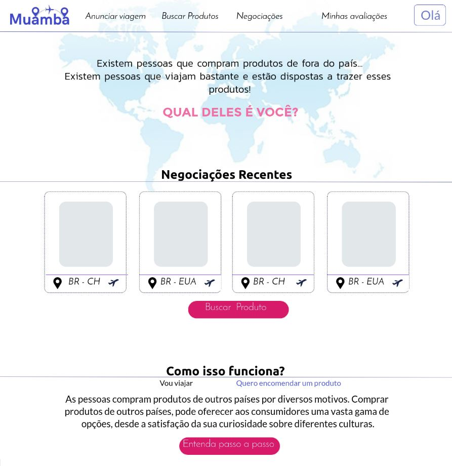
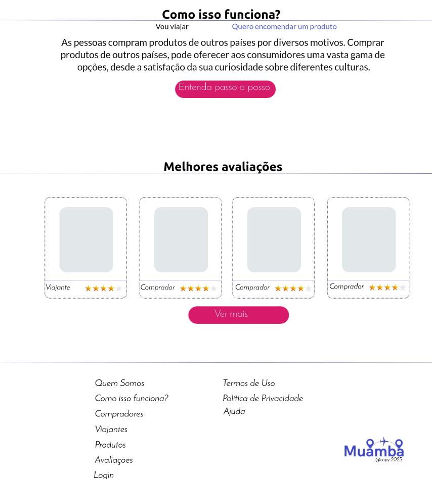
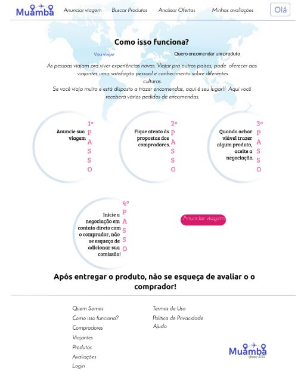
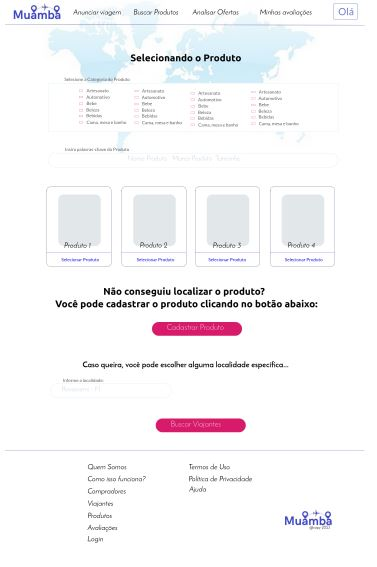
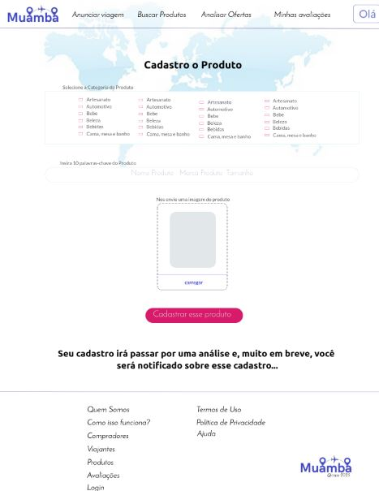
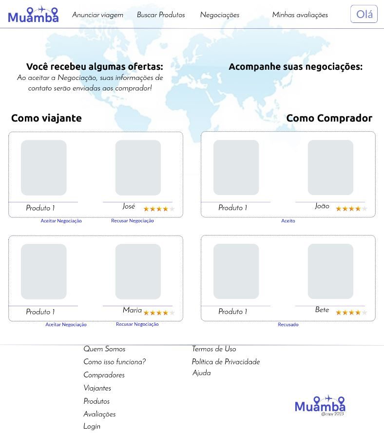
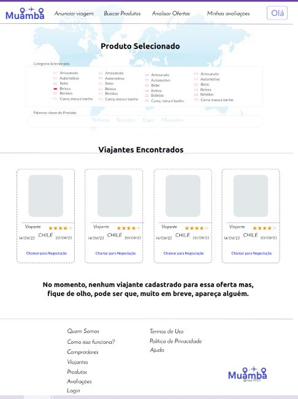
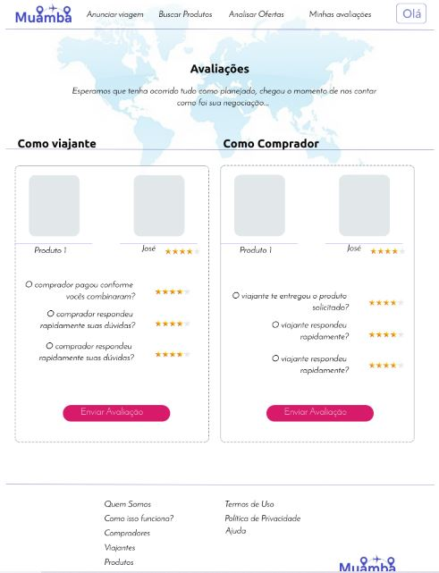
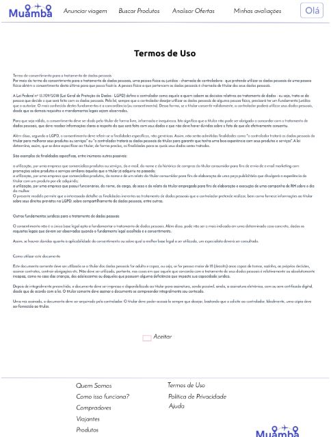
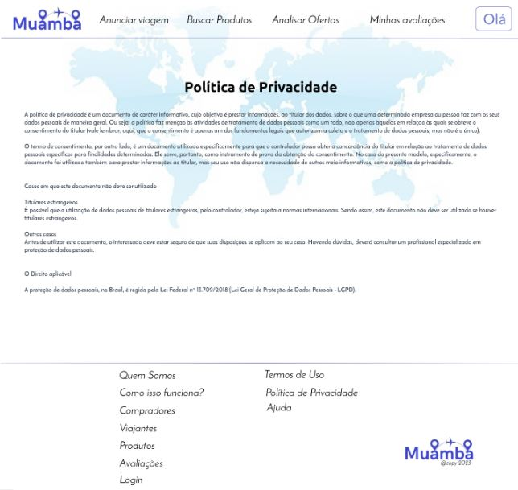

# Programação de Funcionalidades

As telas desenvolvidas para cada uma das funcionalidades do sistema serão apresentadas nessa seção. 

## Página Inicial

 Pagina Inicial

### Requisitos Atendidos
1. Nenhum 

### Artefatos da funcionalidade
1. home_page.html
2. Style.css

### Estrutura de Dados

### Instruções de Acesso
1. Abra um navegador de internet e informe a seguinte URL: [http://muamba.net](http://muamba.net)

## Página De Login

 

### Requisitos Atendidos
1. Nenhum

### Artefatos da funcionalidade
1. login.html
2. Style.css
3. script_muamba.js

### Estrutura de Dados

### Instruções de Acesso
1. Abra um navegador de internet e informe a seguinte URL: [http://muamba.net](http://muamba.net/src/login.html)

## Página De Cadastro (RF-02 / RF-05)

### Requisitos Atendidos
1. RF-02
2. RF-05

### Artefatos da funcionalidade
1. cadastro.html
2. Style.css
3. script_muamba.js

### Estrutura de Dados

### Instruções de Acesso
1. Abra um navegador de internet e informe a seguinte URL: [http://muamba.net](http://muamba.net/src/cadastro.html)

## Página Como Funciona

### Requisitos Atendidos
1. RF-

### Artefatos da funcionalidade
1. como_funciona.html
2. Style.css

### Estrutura de Dados

### Instruções de Acesso
1. Abra um navegador de internet e informe a seguinte URL: [http://muamba.net](http://muamba.net/src/como_funciona.html)

 

## Página Como Funciona Para Viajantes

### Requisitos Atendidos
1. Nenhum

### Artefatos da funcionalidade
1. como_funciona_viajante.html
2. Style.css

### Estrutura de Dados

### Instruções de Acesso
1. Abra um navegador de internet e informe a seguinte URL: [http://muamba.net](http://muamba.net/src/como_funciona_viajante.html)

## Página Como Funciona Para Compradores

 

### Requisitos Atendidos
1. Nenhum

### Artefatos da funcionalidade
1. como_funciona_comprador.html
2. Style.css

### Estrutura de Dados

### Instruções de Acesso
1. Abra um navegador de internet e informe a seguinte URL: [http://muamba.net](http://muamba.net/src/como_funciona_comprador.html)

## Página Buscar Produtos (RF-03 / RF-07)

### Requisitos Atendidos
1. RF-03
2. RF-07

### Artefatos da funcionalidade
1. buscar_produtos.html
2. Style.css
3. script_muamba.js

### Estrutura de Dados

### Instruções de Acesso
1. Abra um navegador de internet e informe a seguinte URL: [http://muamba.net](http://muamba.net/src/buscar_produtos.html)

## Página Cadastrar Produtos (RF-08/RF-09/RF-06)

### Requisitos Atendidos
1. RF-08
2. RF-09
3. RF-06

### Artefatos da funcionalidade
1. cadastrar_produtos.html
2. Style.css
3. script_muamba.js

### Estrutura de Dados

### Instruções de Acesso
1. Abra um navegador de internet e informe a seguinte URL: [http://muamba.net](http://muamba.net/src/cadastrar_produtos.html)

## Página Negociações (RF-04/RF-12/RF-13)

### Requisitos Atendidos
1. RF-04
2. RF-12
3. RF-13

### Artefatos da funcionalidade
1. negociacoes.html
2. Style.css
3. script_muamba.js

### Estrutura de Dados

### Instruções de Acesso
1. Abra um navegador de internet e informe a seguinte URL: [http://muamba.net](http://muamba.net/src/negociacoes.html)

## Página Iniciar Negociação (RF-11)

### Requisitos Atendidos
1. RF-11

### Artefatos da funcionalidade
1. iniciar_negociacao.html
2. Style.css
3. script_muamba.js

### Estrutura de Dados

### Instruções de Acesso
1. Abra um navegador de internet e informe a seguinte URL: [http://muamba.net](http://muamba.net/src/iniciar_negociacao.html)

## Página Anunciar Viagem (RF-14)

### Requisitos Atendidos
1. RF-14

### Artefatos da funcionalidade
1. anunciar_viagem.html
2. Style.css
3. script_muamba.js

### Estrutura de Dados

### Instruções de Acesso
1. Abra um navegador de internet e informe a seguinte URL: [http://muamba.net](http://muamba.net/src/anunciar_viagem.html)

## Página Avaliações (RF-01/RF-10)

### Requisitos Atendidos
1. RF-01

### Artefatos da funcionalidade
1. avaliacoes.html
2. Style.css
3. script_muamba.js

### Estrutura de Dados

### Instruções de Acesso
1. Abra um navegador de internet e informe a seguinte URL: [http://muamba.net](http://muamba.net/src/avaliacoes.html)

## Página Termos De Uso

### Requisitos Atendidos
1. Nenhum

### Artefatos da funcionalidade
1. termos_de_uso.html
2. Style.css

### Estrutura de Dados

### Instruções de Acesso
1. Abra um navegador de internet e informe a seguinte URL: [http://muamba.net](http://muamba.net/src/termos_de_uso.html)

## Página Política De Privacidade

### Requisitos Atendidos
1. Nenhum

### Artefatos da funcionalidade
1. politica_de_privacidade.html
2. Style.css

### Estrutura de Dados

### Instruções de Acesso
1. Abra um navegador de internet e informe a seguinte URL: [http://muamba.net](http://muamba.net/src/politica_de_privacidade.html)